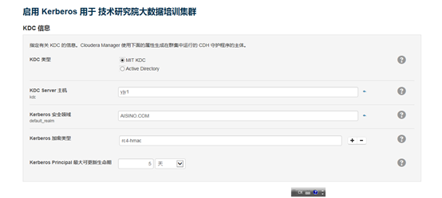
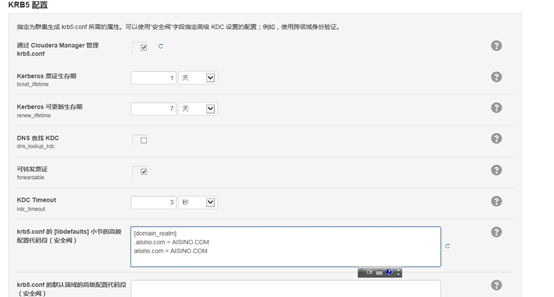
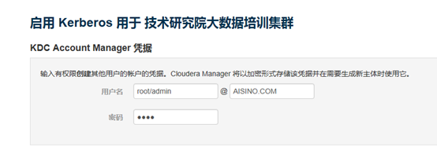
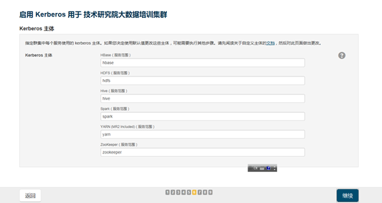
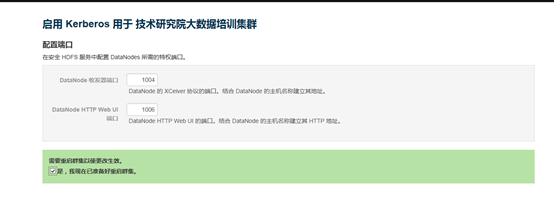

# 1. 服务端
## 1. 安装Kerberos的相关包

```bash
rpm -ivh krb5-libs-1.14.1-27.el7_3.x86_64.rpm
rpm -ivh krb5-devel-1.14.1-27.el7_3.x86_64.rpm
rpm -ivh krb5-workstation-1.14.1-27.el7_3.x86_64.rpm 
rpm -ivh words-3.0-22.el7.noarch.rpm
rpm -ivh krb5-server-1.14.1-27.el7_3.x86_64.rpm 
```

（后两个本地没找到，另外下载）

## 2. 配置kdc.conf和krb5.conf

```bash
sed -i 's/EXAMPLE.COM/AISINO.COM/g' /var/kerberos/krb5kdc/kdc.conf
sed -i 's/AISINOYJY.COM/AISINO.COM/g' /etc/krb5.conf 
sed -i 's/aisinoyjy.com/aisino.com/g' /etc/krb5.conf 
sed -i 's/htxx1/bin01/g' /etc/krb5.conf
```

其中bin01应该为Server的机器名
## 3. 创建、初始化Kerberos Database
- 创建数据库

```bash
/usr/sbin/kdb5_util create -s -r AISINO.COM 
```

> &emsp;&emsp;因为/dev/random的随机数据产生的很少，可以适当的让网卡传输数据，这样有助于产生随机数据，具体原因可以看看/dev/random的原理，使用scp传输点文件一会就好了。</br>

- 为database administrator设置ACL权限</br>

```bash
sed -i 's/EXAMPLE.COM/AISINO.COM/g' /var/kerberos/krb5kdc/kadm5.acl 
```

## 4. 启动服务端的相关服务

```bash
/sbin/service krb5kdc start
/sbin/service kadmin start
chkconfig krb5kdc on
chkconfig kadmin on
```

命令是centos6的，如果在centos7下会有提示改成systemctl。</br>

## 5. 添加Database Administrator

&emsp;&emsp; 输入

```bash
/usr/sbin/kadmin.local -q "addprinc root/admin"  
/usr/sbin/kadmin.local -q "listprincs"
```

## 6. 重新启动服务
&emsp;&emsp;重新执行步骤4。

# 2. 客户端
- 安装libs、devel、workstation三个软件，参考服务端步骤1。
- 将服务端的krb5通过scp复制到客户端/etc/目录下。

# 3. CDH安装
## 1. 为CM新建一个账户，并生成keytab文件

```
kadmin kadmin:addprinc -randkey cloudera-scm/admin@HADOOP.COM
kadmin:xst -k cmf.keytab cloudera-scm/admin@HADOOP.COM
```
>其中HADOOP.COM应该为自定义的域。

## 2. 跟引导程序走
### 1.

### 2.

### 3.

### 4.

### 5.


# 4. 问题解决
## 1. HUE启动问题
&emsp;&emsp;提示Kerberos票证renew问题，查看log显示

```
Couldn't renew kerberos ticket in order to work around Kerberos 1.8.1 issue. 
Please check that the ticket for 'hue/yjy1@AISINO.COM' is still renewable:
```

&emsp;&emsp;google后得到

> If the Hue Kerberos Ticket Renewer does not start, check your KDC configuration and the ticket renewal property, maxrenewlife, for the hue/<hostname> and krbtgt principals to ensure they are renewable. If not, running the following commands on the KDC will enable renewable tickets for these principals.
kadmin.local: modprinc -maxrenewlife 90day krbtgt/YOUR_REALM.COM
kadmin.local: modprinc -maxrenewlife 90day +allow_renewable hue/<hostname>@YOUR-REALM.COM

&emsp;&emsp;重启后OK

## 2. 提示hdfs丢失块和副本不足
&emsp;&emsp;经过搜索应该是和yjy4这台客户端失去联系有关系，查看所有主机发现已经失去联系32天。

```bash
service cloudera-scm-agent status
```

centos7

```bash
centos7 systemctl status cloudera-scm-agent
```
>
<del>后发现服务找不到，重新添加主机应该可以解决，暂时未解决</del>这个方法没有实验，太折腾了。

&emsp;&emsp;经过查看yjy4这台主机，感觉当初安装可能就有问题，或者中途中断，或者是安装好后因为什么原因导致很多cmf相关的服务直接就没有，幸好有其他的从机，那就实验暴力方法，缺什么copy什么。```/etc/init.d/```下的服务直接scp，查看status日志后缺失的文件直接scp，然后去```/var/log/cloudera-scm-agent/cloudera-scm-agent.out```查看错误，发现```/usr/lib64/cmf```下的文件全部缺失，copy完成后start服务成功。

